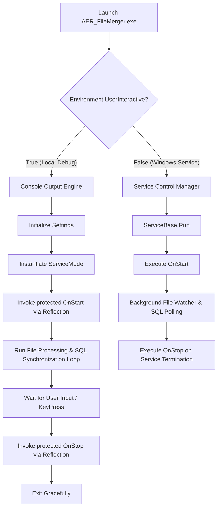
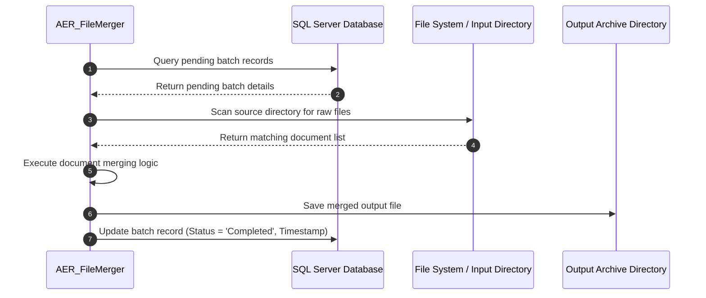

# AER_FileMerger

[](https://dotnet.microsoft.com/download/dotnet-framework/net48)
[](https://docs.microsoft.com/en-us/dotnet/csharp/)
[](https://docs.microsoft.com/en-us/dotnet/framework/windows-services/)
[](#)

`AER_FileMerger` is a automated background utility built in C# (.NET Framework 4.8) designed to monitor, retrieve, and consolidate multi-page document batches (including PDFs, logs, and regulatory submissions) into unified archive files. 

Originally structured as a headless **Windows Service**, this project has been modernized to support **Dual-Execution Modes**—allowing developers to run and debug the core service logic in an interactive console environment or deploy it directly into the Windows Service Control Manager (`services.msc`).

---

## 📋 Key Features

- **Automated Batch Merging**: Automatically processes queued files and merges related documents based on metadata and database instructions.
- **SQL Server Integration**: Connects to a SQL Server database to fetch pending jobs, log operation statuses, and maintain audit trails.
- **Dual Execution Engine**:
  - **Service Mode**: Operates non-interactively in the background under `ServiceBase`.
  - **Interactive Mode**: Automatically detects human execution (`Environment.UserInteractive`) and invokes service routines via C# Reflection within a console window for simplified local debugging.
- **Modern Compiler Features on Legacy Framework**: Utilizes MSBuild overrides (`Directory.Build.props` / `<LangVersion>latest</LangVersion>`) to support modern C# language features (such as Nullable Annotations and pattern matching) on .NET Framework 4.8.

---

## 🏗️ Architecture & Execution Workflow

The application evaluates its running context upon launch to determine whether to start the Windows Service Controller or launch the interactive debugging console.

### System Architecture Diagram



### File Processing Lifecycle



---

## ⚙️ Interactive Debug Mode vs. Windows Service Mode

| Feature | Interactive Mode (`Environment.UserInteractive = True`) | Windows Service Mode (`Environment.UserInteractive = False`) |
| :--- | :--- | :--- |
| **Execution Trigger** | Direct Double-click or Visual Studio `F5` | Managed by Windows Service Control Manager (`services.msc`) |
| **Output Type** | Console Window (`Console.WriteLine` visible) | Silent Background Process / Windows Event Log |
| **Deployment Requirement**| None | Requires `installutil.exe` installation |
| **Use Case** | Local Development, Breakpoint Debugging, Testing | Production Server Deployment |

---

## 🗄️ Database Setup & Configuration

`AER_FileMerger` uses SQL Server for job orchestration and activity logging. 

### Configuration File (`App.config`)

Ensure your database connection string and parameters are correctly configured:

```xml
<?xml version="1.0" encoding="utf-8"?>
<configuration>
  <appSettings>
    <add key="DB_Server" value="YOUR_SERVER_NAME" />
    <add key="DB_Username" value="sa" />
    <add key="DB_Password" value="YOUR_PASSWORD" />
    <add key="SourceDirectory" value="C:\AER_Files\Input" />
    <add key="OutputDirectory" value="C:\AER_Files\Output" />
  </appSettings>
  <startup> 
    <supportedRuntime version="v4.0" sku=".NETFramework,Version=v4.8" />
  </startup>
</configuration>
```

### Logging Schema

The service references a logging schema similar to the following SQL structure:

```sql
CREATE TABLE [dbo].[ProcessedRecords] (
    [Id] INT IDENTITY(1,1) PRIMARY KEY,
    [FileName] NVARCHAR(255) NOT NULL,
    [ProcessedDate] DATETIME DEFAULT GETDATE(),
    [Status] NVARCHAR(50) NOT NULL,
    [ErrorMessage] NVARCHAR(MAX) NULL
);
```

---

## 🚀 Getting Started & Local Development

### Prerequisites

- **Visual Studio 2022** (with *.NET desktop development* workload installed)
- **.NET Framework 4.8 SDK**
- **SQL Server Management Studio (SSMS)** or active SQL Server instance

### Running locally in Visual Studio

1. Clone the repository:
   ```bash
   git clone https://github.com/YOUR_USERNAME/AER_FileMerger.git
   ```
2. Open `AER_FileMerger.sln` in Visual Studio.
3. Verify that the project Output Type is set to **Console Application** (Properties -> Application -> Output type).
4. Update `App.config` with valid database credentials.
5. Press **F5** to run in **Interactive Mode**.

### Installing as a Windows Service (Production Deployment)

1. Open **Developer Command Prompt for Visual Studio** as Administrator.
2. Build the project in `Release` configuration.
3. Install the service using `installutil.exe`:
   ```cmd
   installutil.exe "C:\Path\To\Release\AER_FileMerger.exe"
   ```
4. Start the service via Windows Services Manager:
   ```cmd
   net start AER_FileMerger
   ```
5. To uninstall:
   ```cmd
   installutil.exe /u "C:\Path\To\Release\AER_FileMerger.exe"
   ```

---

## 🛠️ Tech Stack & Dependencies

- **Language**: C#
- **Target Framework**: .NET Framework 4.8
- **Language Version**: C# Latest (`<LangVersion>latest</LangVersion>`)
- **Key Namespaces**:
  - `System.ServiceProcess`: Core service scaffolding
  - `System.Reflection`: Interactive mode invocation
  - `System.Data.SqlClient`: Database access and job processing
  - `System.IO`: File system scanning and manipulation